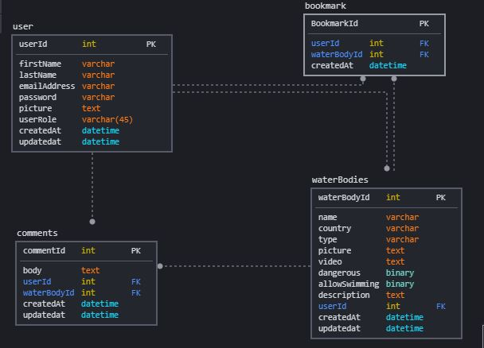

# WonderWater-Back-End
The Back end side of Wonder Water, a website that allows users to share and view strange and wonderful water bodies from all around the world. 

## Important Links

- [Front End Side Repo](https://git.generalassemb.ly/fatimah-al-ibrahim/WonderWater-Front-End)
- [Deployed API](http://wonderwater-env.eba-xrp2ugc4.us-east-2.elasticbeanstalk.com/)
- [Deployed Client](https://pages.git.generalassemb.ly/fatimah-al-ibrahim/WonderWater-Front-End/)

## Planning Story

1. Create the security related classes and interfaces along with the user model and jwt token classes.
1. Create the user controller with its REST API's and test them using Postman.
1. Create the next model and dao.
1. Create the controller with its REST API's and test them using Postman.
1. Repeat step 3 and 4 for all needed models.

## Technologies Used

- GitHub
- Spring Boot
- Spring Security
- JWT

## Catalog of Routes

| Verb  | URI Pattern            | Description |
| ----  | -----------            | ----------- |
| POST  | /user/registration     | Receive the user object in the request body and create the user account if it doesn't already exists |
| POST  | /user/authentication   | Receive the user email and password in the request body as a user object and check if they are correct or not. return the JWT token if the information is correct |
| GET   | /user/userInfo/:email  | Receive the user email as a param and return the user information as a user object |
| POST  | /user/checkPassword    | Receive the user password and id as a hash map in the request body and check if the password belong to the user whose id was given |
| PUT   | /user/edit            | Receive the user object in the request body and update the user information |
| GET   | /waterbody/index      | Return all the water bodies in the database                                 |
| GET   | /waterbody/details/:id| Receive the water body id as a param and return its details as a water body object |
| POST  | /waterbody/add        | Receive the water body object in the request body and insert it in the database |
| PUT   | /waterbody/edit       | Receive the water body object in the request body and update its information in the database |
| DELETE| /waterbody/delete/:id | Receive the water body id in the param and delete the water body from the database |
| GET   | /waterbody/find/:id   | Receive the user id in the param and return all the water bodies that this user has added |
| POST  | /comment/add          | Receive the comment object in the request body and and insert it in the database |
| PUT   | /comment/edit         | Receive the comment object in the request body and update its information in the database |
| DELETE| /comment/delete/:id   | Receive the comment id in the param and delete the comment from the database |
| GET   | /bookmark/find/:id    | Receive the user id in the param and all the bookmark the user has along with their water body data |
| POST  | /bookmark/add         | Receive the bookmark object in the request body and and insert it in the database |
| DELETE| /bookmark/delete/:id  | Receive the bookmark id in the param and delete the bookmark from the database |
---

## Unsolved Problems
There are no unsolved problems

## Installation Instructions
Fork and clone or download this repo and the front end repo of this project whose link is at the beginning in the important link

## Images

### ERD:
